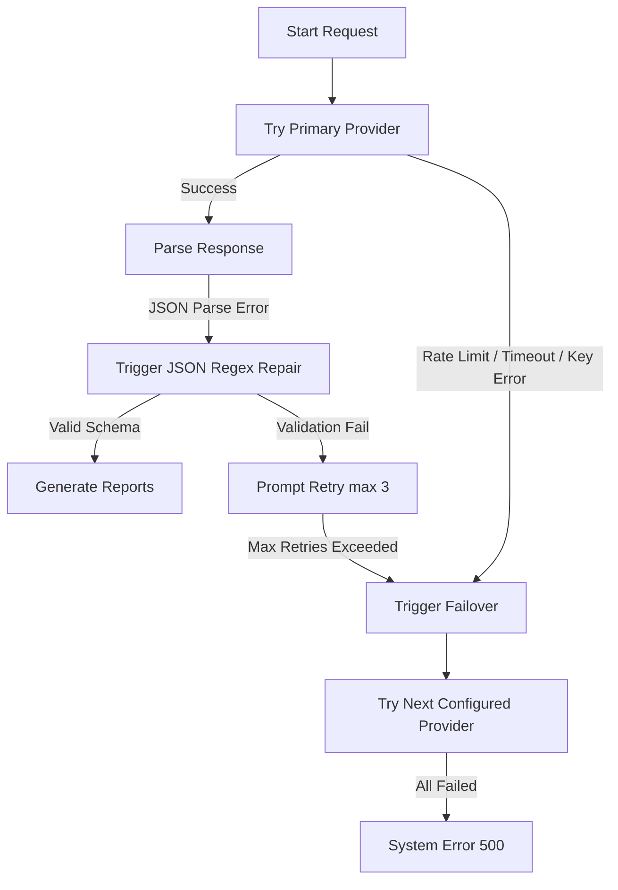
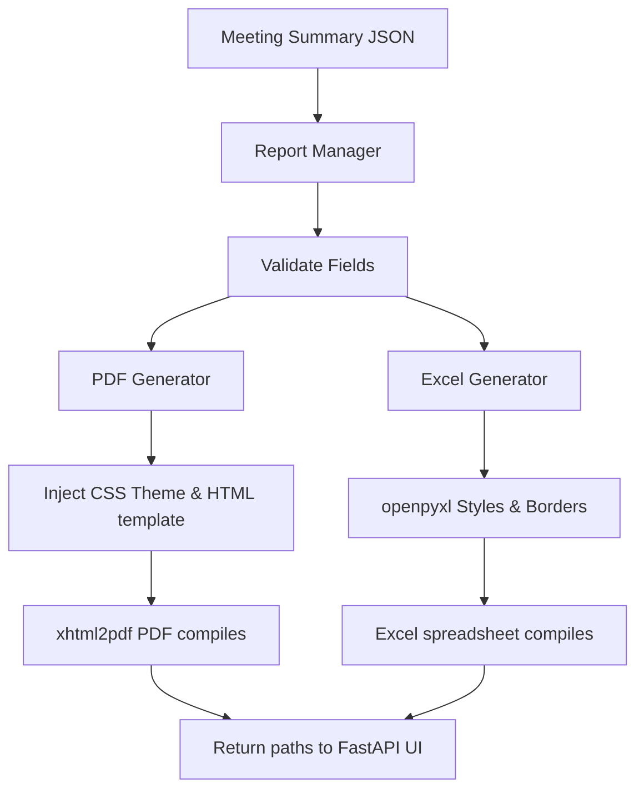

# 🎤 AI Meeting Minutes (AI MOM)

A production-quality desktop application that records or uploads audio from meetings, transcribes them using speech-to-text engines, and analyzes them to generate structured meeting intelligence, corporate PDF summaries, and Excel action trackers.

Built with **Python 3.12**, **CustomTkinter**, **FastAPI**, **openpyxl**, and **xhtml2pdf**.

---

## ✨ Features

### 🎧 Audio & Speech-to-Text (STT)
- **Upload Audio** — Supports WAV, MP3, M4A, AAC, OGG, FLAC.
- **Record Voice** — 16 kHz mono PCM recording via microphone.
- **Auto-Convert** — Non-WAV files are automatically converted using FFmpeg.
- **Multiple STT Engines** — Switch between engines from the UI:
  - NVIDIA Parakeet CTC 1.1B
  - NVIDIA Whisper Large v3
  - Deepgram Nova-3
  - Deepgram Nova-2
- **Multi-Language** — English, Kannada, Hindi, Tamil, Telugu, Auto.
- **Immediate Cleanup** — Audio files are deleted immediately after transcription completes.

### 🧠 Phase 3: AI Intelligence (LLM)
- **Abstract Provider Interface** — Unified API wrapper with simple setup for:
  - **NVIDIA NIM** (supports standard OpenAI-compatible completions format)
  - **Groq Cloud**
  - **Google Gemini** (generateContent REST API)
  - **Ollama** (local server)
- **Robust Failover Engine** — Automatically redirects requests to alternative providers if the primary provider hits rate limits (503s), connection issues, or timeouts.
- **Auto-detected Ollama Models** — Ollama automatically queries `/api/tags` to list installed models and falls back to the first available local model instead of failing on a 404 model not found error.
- **Pydantic Validation & Repair** — Performs JSON cleaning and regex formatting repair (e.g. trailing commas) with automatic generation retry capability.

### 📥 Phase 4: Corporate Export & Reporting
- **Professional PDF Summaries (`xhtml2pdf`)** — Generates print-ready PDFs containing the corporate logo, meeting metadata, executive summary, topics, decisions, risks, structured action items, timeline, sentiment analysis, and an AI generated disclaimer.
- **Action Tracker Spreadsheets (`openpyxl`)** — Populates tasks, owners, target dates, priority levels, and notes. Styles headers, enables auto-filters, autowraps long text, freezes the header row, and auto-adjusts column widths.
- **Branded Configurations** — Full theme adjustments (HEX colors, company name, logo path) loaded dynamically from configurations.

---

## 🗂️ Project Structure

```
AIMOM/
├── app.py                      # FastAPI App entry point & routers
├── .env / .env.example         # Environment and credential config
├── requirements.txt            # Python dependencies (openpyxl, xhtml2pdf, etc.)
│
├── config/
│   └── settings.py             # Centralized configurations & constants
│
├── models/
│   └── recording.py            # Recording & TranscriptionResult dataclasses
│
├── utils/
│   ├── logger.py               # Rotating file + console logging
│   └── file_utils.py           # Directory creation, file validation
│
├── services/
│   ├── audio/
│   │   ├── recorder.py         # Microphone recording (sounddevice)
│   │   └── converter.py        # FFmpeg WAV conversion
│   └── stt/
│       ├── base.py             # Abstract BaseSTTProvider interface
│       ├── nvidia_provider.py  # NVIDIA Riva gRPC STT (Parakeet + Whisper)
│       ├── deepgram_provider.py # Deepgram SDK v7 STT (Nova-3 + Nova-2)
│       └── provider_manager.py # Registry pattern for STT models
│
├── ai/                         # Phase 3: AI Intelligence Module
│   ├── provider.py             # Abstract BaseAIProvider definition
│   ├── manager.py              # AIManager selectors & failover loops
│   ├── nvidia_provider.py      # NVIDIA NIM LLM provider
│   ├── groq_provider.py        # Groq completions provider
│   ├── gemini_provider.py      # Google Gemini REST provider
│   ├── ollama_provider.py      # Local Ollama provider
│   ├── prompts.py              # System & User prompt declarations
│   ├── parser.py               # Pydantic JSON parser & regex repair
│   └── schemas.py              # Pydantic output model schemas
│
├── reports/                    # Phase 4: Document Reporting Engine
│   ├── report_manager.py       # Validates summary details, coordinates exports
│   ├── pdf_generator.py        # HTML-to-PDF compiler via xhtml2pdf
│   ├── excel_generator.py      # Spreadsheet generator using openpyxl
│   ├── templates/
│   │   ├── meeting_template.html # PDF page print layout
│   │   └── styles.css          # CSS styles (margins, page numbers, grid colors)
│   └── assets/
│       └── company_logo.png    # Selected corporate logo
│
├── recordings/                 # Saved voice recordings
├── output/                     # Generated transcripts
├── temp/                       # Temporary converted WAV files
└── logs/                       # Application logs (app.log)
```

---

## 🚀 Getting Started

### Prerequisites

- **Python 3.12+**
- **FFmpeg** — installed and available on your system PATH.
- API keys from your choice of providers:
  - NVIDIA NIM
  - Deepgram
  - Groq Cloud
  - Google AI Studio (Gemini)
  - Ollama (running locally at `http://localhost:11434`)

### Installation

```bash
# Open the project
cd C:\Users\Vaps\PycharmProjects\AIMOM

# Create virtual environment
python -m venv .venv
.venv\Scripts\activate

# Install dependencies
pip install -r requirements.txt
```

### Configuration

Copy the example env file and add your credentials:

```bash
copy .env.example .env
```

Edit `.env`:

```env
# Speech-to-Text Keys
NVIDIA_API_KEY=nvapi-your-key-here
DEEPGRAM_API_KEY=your-deepgram-key-here

# LLM Providers (Add one or more)
GROQ_API_KEY=gsk_your-groq-key-here
GEMINI_API_KEY=AIzaSy-your-gemini-key-here
OLLAMA_BASE_URL=http://localhost:11434

# Primary AI Selection
AI_PROVIDER=nvidia # Options: nvidia, groq, gemini, ollama
AI_MODEL=nvidia/nemotron-3-ultra-550b-a55b

# Corporate Branding Parameters
COMPANY_NAME=VAPS TECHNOSOFT PVT. LTD.
COMPANY_LOGO_PATH=C:\Users\Vaps\PycharmProjects\AIMOM\img.png
COMPANY_THEME_COLOR=#1e3a8a
COMPANY_SECONDARY_COLOR=#3b82f6
```

### Run the Application

```bash
python app.py
```

Open `http://localhost:8000` in your web browser.

---

## 🖥️ Usage

1. **Enter a Meeting Title** — Used for naming outputs.
2. **Choose Audio Source**:
   - **Upload Audio** — Select a supported format.
   - **Record Voice** — Click the red microphone button, speak, and stop when finished.
3. **Select STT Engine & Language** — Switch between providers and language targets.
4. **Click "Start Transcription"** — The background pipeline will process the audio, execute LLM meeting minutes extraction, and export both PDF and Excel reports.
5. **Download Reports** — Download buttons for the PDF Report and Excel Tracker will appear immediately.

---

## 🏗️ Architecture

### AI Failover Flow


### Report Export Flow


---

## 📦 Tech Stack

| Component | Technology |
|-----------|------------|
| Language | Python 3.12 |
| Backend Server | FastAPI |
| STT Client | sounddevice, nvidia-riva-client (gRPC), deepgram-sdk v7 |
| LLM API | Requests (Groq, NVIDIA NIM, Gemini, Ollama REST API) |
| PDF Export | xhtml2pdf |
| Excel Export | openpyxl |
| Environment | python-dotenv |

---

## 📋 Phase Roadmap

- [x] **Phase 2** — Audio Upload + Recording + Speech-to-Text
- [x] **Phase 3** — AI Summary & Intelligence Extraction
- [x] **Phase 4** — PDF Report & Excel Action Tracker Exports

---

## 📝 License

This project is for internal/personal use.
