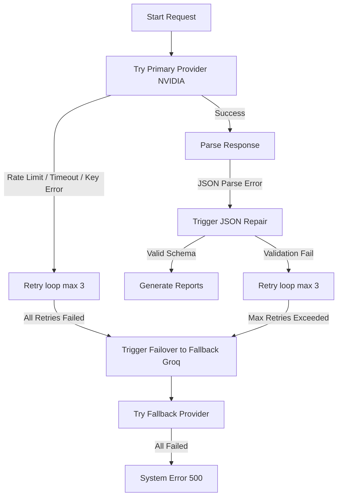
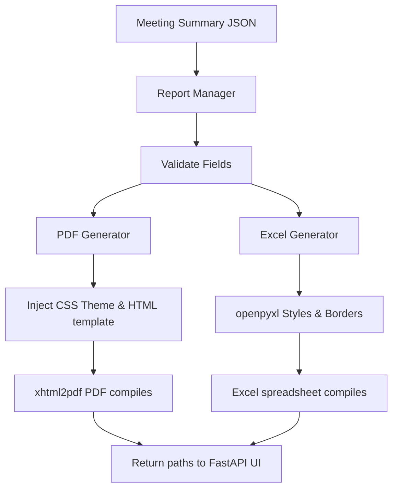

# 🎤 AI Meeting Minutes (AI MOM)

A production-quality desktop application that records or uploads audio from meetings, transcribes them using speech-to-text engines, and analyzes them to generate structured meeting intelligence, corporate PDF summaries, and Excel action trackers.

Built with **Python 3.12**, **FastAPI**, **openpyxl**, and **xhtml2pdf**.

---

## ✨ Features

### 🎧 Audio & Speech-to-Text (STT)
- **Upload Audio** — Supports WAV, MP3, M4A, AAC, OGG, FLAC.
- **Record Voice** — 16 kHz mono PCM recording via microphone.
- **Auto-Convert** — Non-WAV files are automatically converted using FFmpeg.
- **Multiple STT Engines** — Switch between engines from the UI:
  - NVIDIA Parakeet CTC 1.1B
  - NVIDIA Whisper Large v3
  - Deepgram Nova-3
  - Deepgram Nova-2
- **Multi-Language** — English, Kannada, Hindi, Tamil, Telugu, Auto.
- **Immediate Cleanup** — Audio files are deleted immediately after transcription completes.

### 🧠 Phase 3: AI Intelligence (LLM) & 4-Agent Pipeline
- **Centralized Provider Layer** — Centralized `ProviderManager` handles all LLM queries for the pipeline.
- **Robust Failover Engine** — Automatically redirects requests from NVIDIA (primary) to Groq (fallback) if the primary provider hits rate limits (503s), connection issues, or timeouts.
- **Exponential Backoff** — Retries failed transient queries with backoff (2s -> 4s -> 8s) to bypass temporary free-tier limits without long blocks.
- **Health monitoring & auto-recovery** — Automatically resumes using NVIDIA when it returns to operational health.
- **Pydantic Validation & Repair** — Performs JSON cleaning and regex formatting repair (e.g. trailing commas).
- **Sequential 4-Agent Pipeline**:
  - **Agent 1 (Topic Seg)**: Topic segmentation based on meeting agenda.
  - **Agent 2 (Extraction)**: Merged discussion + action extraction in a single prompt.
  - **Agent 3 (Synthesis)**: Decision synthesis and executive summary generation.
  - **Agent 4 (Validation)**: Validates results without blocking report generation.

### 📥 Phase 4: Corporate Export & Reporting
- **Professional PDF Summaries (`xhtml2pdf`)** — Generates print-ready PDFs containing the corporate logo, meeting metadata, executive summary, topics, decisions, risks, structured action items, timeline, sentiment analysis, and an AI generated disclaimer.
- **Action Tracker Spreadsheets (`openpyxl`)** — Populates tasks, owners, target dates, priority levels, and notes. Styles headers, enables auto-filters, autowraps long text, freezes the header row, and auto-adjusts column widths.
- **Branded Configurations** — Full theme adjustments (HEX colors, company name, logo path) loaded dynamically from configurations.

---

## 🗂️ Project Structure

```
AIMOM/
├── app.py                      # FastAPI App entry point & routers
├── .env / .env.example         # Environment and credential config
├── requirements.txt            # Python dependencies (openpyxl, xhtml2pdf, etc.)
│
├── config/
│   └── settings.py             # Centralized configurations, constants, & model override defaults
│
├── models/
│   └── recording.py            # Recording & TranscriptionResult dataclasses
│
├── utils/
│   ├── logger.py               # Rotating file + console logging
│   └── file_utils.py           # Directory creation, file validation
│
├── services/
│   ├── audio/
│   │   └── converter.py        # FFmpeg WAV conversion
│   └── stt/
│       ├── base.py             # Abstract BaseSTTProvider interface
│       ├── nvidia_provider.py  # NVIDIA Riva gRPC STT (Parakeet + Whisper)
│       ├── deepgram_provider.py # Deepgram SDK STT (Nova-3 + Nova-2)
│       └── provider_manager.py # Registry pattern for STT models
│
├── ai/                         # Phase 3: AI Intelligence Module
│   ├── models/
│   │   ├── chunk.py            # Intermediate chunk schemas
│   │   └── meeting.py          # Final output MeetingSummary schema
│   ├── pipeline/
│   │   ├── manager.py          # AIManager orchestrator
│   │   └── six_agent_pipeline.py # FourAgentPipeline class definition
│   ├── providers/
│   │   ├── base.py             # BaseAIProvider abstract class
│   │   ├── groq.py             # Groq provider class
│   │   ├── nvidia/             # Modular NVIDIA NIM strategy pattern
│   │   ├── gemini.py           # Google Gemini provider
│   │   ├── ollama.py           # Local Ollama provider
│   │   └── provider_manager.py # Centralized failover & recovery ProviderManager
│   ├── prompting/
│   │   └── templates.py        # System prompts and prompts
│   ├── stages/
│   │   ├── transcript_cleaner.py # Python cleaner
│   │   └── chunking_engine.py    # Python text chunker
│   └── validators/
│       └── validation_layer.py # Python validators and repair
│
├── reports/                    # Phase 4: Document Reporting Engine
│   ├── report_manager.py       # Validates summary details, coordinates exports
│   ├── pdf_generator.py        # HTML-to-PDF compiler via xhtml2pdf
│   ├── excel_generator.py      # Spreadsheet generator using openpyxl
│   └── templates/
│       └── meeting_template.html # PDF print layout template
│
└── output/                     # Generated transcripts
```

---

## 🚀 Getting Started

### Prerequisites

- **Python 3.12+**
- **FFmpeg** — installed and available on your system PATH.
- API keys from your choice of providers:
  - NVIDIA NIM
  - Deepgram
  - Groq Cloud
  - Google AI Studio (Gemini)
  - Ollama (running locally at `http://localhost:11434`)

### Installation

```bash
# Open the project
cd C:\Users\Vaps\PycharmProjects\AIMOM

# Create virtual environment
python -m venv .venv
.venv\Scripts\activate

# Install dependencies
pip install -r requirements.txt
```

### Configuration

Copy the example env file and add your credentials:

```bash
copy .env.example .env
```

Edit `.env`:

```env
# Speech-to-Text Keys
NVIDIA_API_KEY=nvapi-your-key-here
DEEPGRAM_API_KEY=your-deepgram-key-here

# LLM Providers (Add one or more)
GROQ_API_KEY=gsk_your-groq-key-here
GEMINI_API_KEY=AIzaSy-your-gemini-key-here
OLLAMA_BASE_URL=http://localhost:11434

# 4-Agent pipeline model overrides
AGENT1_MODEL=deepseek-ai/deepseek-v4-flash
AGENT2_MODEL=z-ai/glm-5.2
AGENT3_MODEL=nvidia/nemotron-3-ultra-550b-a55b
AGENT4_MODEL=openai/gpt-oss-120b

# Corporate Branding Parameters
COMPANY_NAME=VAPS TECHNOSOFT PVT. LTD.
COMPANY_LOGO_PATH=C:\Users\Vaps\PycharmProjects\AIMOM\reports\assets\company_logo.png
COMPANY_THEME_COLOR=#1e3a8a
COMPANY_SECONDARY_COLOR=#3b82f6
```

### Run the Application

```bash
python -m uvicorn app:app --host 0.0.0.0 --port 8000
```

Open `http://localhost:8000` in your web browser.

---

## 🖥️ Usage

1. **Enter a Meeting Title** — Used for naming outputs.
2. **Choose Audio Source**:
   - **Upload Audio** — Select a supported format.
   - **Record Voice** — Click the red microphone button, speak, and stop when finished.
3. **Select STT Engine & Language** — Switch between providers and language targets.
4. **Click "Start Transcription"** — The background pipeline will process the audio, execute LLM meeting minutes extraction, and export both PDF and Excel reports.
5. **Download Reports** — Download buttons for the PDF Report and Excel Tracker will appear immediately.

---

## 🏗️ Architecture

### AI Failover Flow


### Report Export Flow

