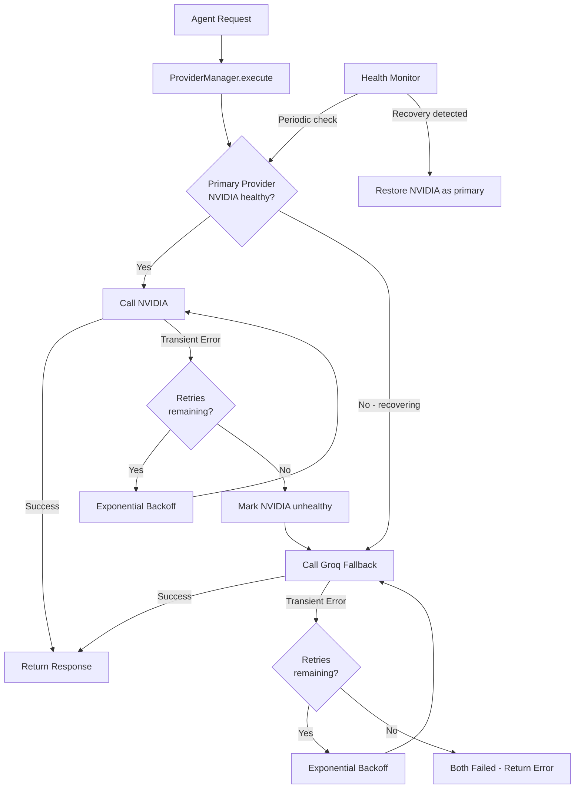

# AIMOM: LLM Pipeline Architecture Documentation

Here is a comprehensive breakdown of how Large Language Models (LLMs) are utilized within the meeting analysis pipeline.

## Overview

The application is a FastAPI-based backend that handles transcription (STT) and subsequent AI analysis of meeting transcripts to generate Minutes of Meeting (MoM) reports. 

The core of the LLM orchestration is managed by `AIManager` (`ai/pipeline/manager.py`) which delegates execution to the **Four-Agent Pipeline** (`FourAgentPipeline` in `ai/pipeline/six_agent_pipeline.py`). All LLM requests route through the centralized `ProviderManager` (`ai/providers/provider_manager.py`) to manage API retries, rate limits, health monitoring, and automatic failovers.

---

## 1. Centralized Provider Management (`ProviderManager`)

To maintain high availability and reliability on free-tier APIs, the codebase does not call model APIs directly. Instead, every LLM call routes through `ProviderManager` which acts as a resilient gateway.



### Key Capabilities
- **Automatic Failover**: If the primary provider (NVIDIA) fails or rate-limits, requests are automatically routed to the fallback provider (Groq) with equivalent model configurations.
- **Exponential Backoff**: Transient errors (429 Rate Limit, 5xx Server Errors, Connection Timeouts) trigger 3 retries with increasing delay (2s -> 4s -> 8s) rather than blocking on long cooldown periods.
- **Dynamic Context Budgeting**: If a model returns a truncated response, the manager automatically catches it and retries with an expanded `max_tokens` limit.
- **Health Monitoring & Auto-Recovery**: If a provider is marked unhealthy, the manager periodically sends probes in the background. Once the provider is responsive again, future requests automatically route back to it without requiring an application restart.

---

## 2. The Four-Agent Pipeline

The transcript analysis is handled in a structured, multi-agent sequence. 

```
[Raw Transcript] ──> [Cleaner (Python)] ──> [Chunker (Python)]
                                                   │
   ┌───────────────────────────────────────────────┘
   │
   ├──> Agent 1: Topic Segmentation (NVIDIA DeepSeek)  ──> topics
   │
   ├──> Agent 2: Discussion + Actions (NVIDIA GLM)     ──> discussions & actions
   │
   ├──> Agent 3: Final Synthesis (NVIDIA Nemotron)     ──> MeetingSummary
   │
   └──> Agent 4: Validation (Groq — Optional)          ──> warnings
```

### Flow Breakdown

#### Step 1: Pre-processing (Pure Python)
1. **Transcript Cleaner**: Normalizes text and strips filler words.
2. **Chunking Engine**: Splits the text into token-budgeted chunks (900 tokens) with 3 lines of overlap to preserve conversational context across chunk boundaries.

#### Step 2: Agent 1 — Topic Segmentation
- **Model**: NVIDIA `deepseek-ai/deepseek-v4-flash` (Fallback: Groq `openai/gpt-oss-120b`)
- **Role**: Identifies key meeting topics and agenda mappings for each chunk.

#### Step 3: Agent 2 — Discussion & Action Item Extraction
- **Model**: NVIDIA `z-ai/glm-5.2` (Fallback: Groq `openai/gpt-oss-120b`)
- **Role**: Extracts detailed discussion narratives and associated action items (including tasks, owners, and target dates) in a single LLM call per chunk.
- **Python Post-processing**: Action items are automatically deduplicated via sequence matching (85% similarity threshold).

#### Step 4: Agent 3 — Final Synthesis
- **Model**: NVIDIA `nvidia/nemotron-3-ultra-550b-a55b` (Fallback: Groq `openai/gpt-oss-120b`)
- **Role**: Merges extracted points into a cohesive report, generates the executive summary, and extracts parking lot, decisions, and risk items.

#### Step 5: Agent 4 — Validation (Optional)
- **Model**: Groq `openai/gpt-oss-120b`
- **Role**: Scans the generated summary for logical inconsistencies.
- **Constraint**: Wrapped in try/except blocks; errors here will log warnings but never prevent the report from compiling and exporting.

---

## 3. Model Mappings

| Agent | Primary Provider (Model) | Fallback Provider (Model) | Max Tokens |
|-------|--------------------------|---------------------------|------------|
| **Agent 1** (Topic Seg) | NVIDIA (`deepseek-ai/deepseek-v4-flash`) | Groq (`openai/gpt-oss-120b`) | 1200 |
| **Agent 2** (Discussion+Action) | NVIDIA (`z-ai/glm-5.2`) | Groq (`openai/gpt-oss-120b`) | 2400 |
| **Agent 3** (Synthesis) | NVIDIA (`nvidia/nemotron-3-ultra-550b-a55b`) | Groq (`openai/gpt-oss-120b`) | 1800 |
| **Agent 4** (Validation) | Groq (`openai/gpt-oss-120b`) | None | 1200 |
